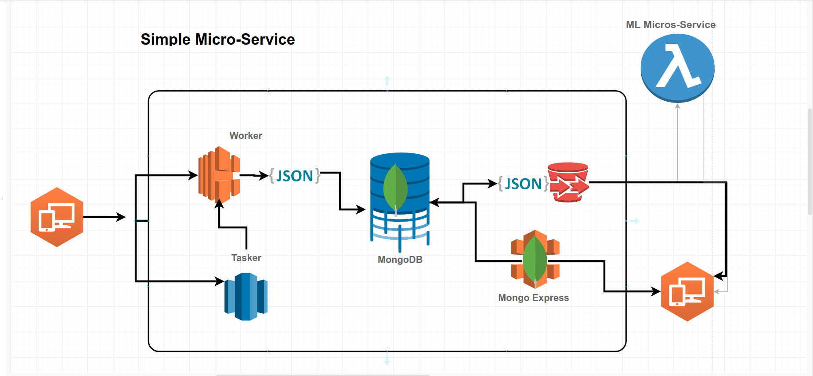
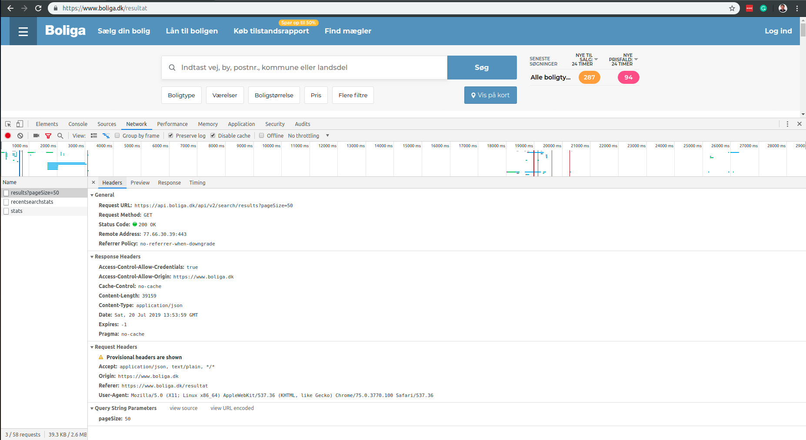
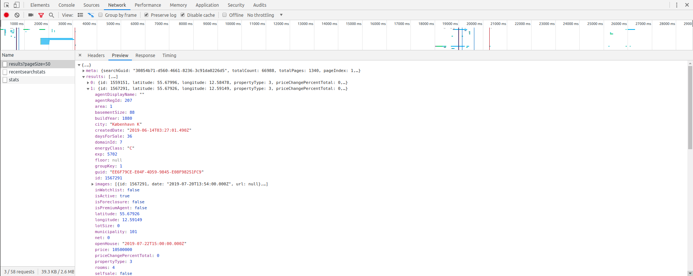

# Web Scraping: PyData Copenhagen

> Tips and Tricks for web data collections using Python

From basic  to advance web scraping, these are my tips and tricks on how to gather, automate, and store web data using Python's rich eco-systems.



## Do's and Don'ts of Web Scraping
- Don't Be A Clown
- Always read and understand 'Terms of Use'
- Go Gentle
- Be Open

## Talk
* What I have learned, unlearned and discovering in Web Scraping

* Not everyone likes Chips & Fish: These are my opinions of do-s and don'ts

Road Ahead:

- Basics: Leaving the Basics Behind
- Better: It simple, but not always
- Advance: [Web Scraping Micro-services](https://github.com/Proteusiq/advance_scraping)

## Installation

Assuming that you have git, Anaconda or miniconda installed in your system:

Clone Repo:

```sh
git clone https://github.com/Proteusiq/Web-Scraping-PyData.git
cd Web-Scraping-PyData
```
#### Automatic: Recreate the environment from yaml:

```sh
conda env create -f environment.yml
conda activate talks
```

If automatic creation of the environment above failed, you can manually create the environment

#### Manually [Only if automatic failed]:

```sh
conda create -n talks python=3.7 pandas requests beautifulsoup4 lxml selenium jupyterlab ipython

conda activate talks
conda install -c conda-forge nodejs
pip install requests_html tqdm fuzzywuzzy[speed] html5lib python-Levenshtein
```


## Presentation

```sh
conda activate talks
cd Presentation
npm install # Needed only once
npm start
```


## Notebooks

```sh
jupyter lab --port 8004
```

Navigate to notebooks. Notebooks are chronological numbered to explain
presented tips and tricks.

## Examples

Examples highlighting the use Network to gather data.



Results:


code examples:

- `bilbase.py` and `bilbase_api.py`: how to write same code with two different approaches
- `bolig_network.py`: how to write a single code that capture almost all Denmark's real estates data.
- `boliga_progress_bar.py`: how to add a progress bar in web scraping
- `advance> run example.py`: Advance web scraping. Build friendly API: a single class to rule them all
- coming soon logging, mongodb, celery, and more

You can run any example as:
```sh
cd examples
python bilbase.py
```

## Release History

Comming Soon
* 0.1.5
    * ADD: Micro-service repo
    * CHANGE: New examples and use of selenium
* 0.1.4
    * CHANGE: Adding Nodejs 
    * ADD: Scrabing using JavaScript
 
* 0.0.1
    * Work in progress
    
    
## Resources:
[Awesome Web Scraping (Python) ](https://github.com/lorien/awesome-web-scraping/blob/master/python.md)

## Meta

Prayson Daniel – [@proteusiq](https://twitter.com/proteusiq) – praysonwilfred@gmail.com

Distributed under the MIT license. See ``LICENSE`` for more information.

[https://github.com/praysondaniel/github-link](https://github.com/proteusiq/)

## Contributing

1. Fork it (<https://github.com/Proteusiq/Web-Scraping-PyData/fork>)
2. Create your feature branch (`git checkout -b feature/fooBar`)
3. Commit your changes (`git commit -am 'Add some fooBar'`)
4. Push to the branch (`git push origin feature/fooBar`)
5. Create a new Pull Request
