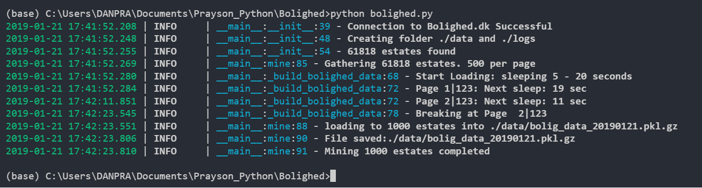

# Bolighed Data Mining
> Gather data from bolighed.dk api


Easiest way to get current real estate data availabe in bolighed.dk.



## Installation

Windows, OS X & Linux:

```sh
pip install bolighed
```


## Usage example

Coming soon


## Development setup

Coming soon

```sh
make install
npm test
```

## Release History

Comming Soon
* 0.1.5
    * CHANGE: Update docs (module code remains unchanged)
* 0.1.4
    * CHANGE: Remove `setDefaultXYZ()`
    * ADD: Add `init()`
 
* 0.0.1
    * Work in progress

## Meta

Your Name – [@YourTwitter](https://twitter.com/proteusiq) – praysonwilfred@gmail.com

Distributed under the MIT license. See ``LICENSE`` for more information.

[https://github.com/praysondaniel/github-link](https://github.com/proteusiq/)

## Contributing

1. Fork it (<https://github.com/yourname/yourproject/fork>)
2. Create your feature branch (`git checkout -b feature/fooBar`)
3. Commit your changes (`git commit -am 'Add some fooBar'`)
4. Push to the branch (`git push origin feature/fooBar`)
5. Create a new Pull Request
